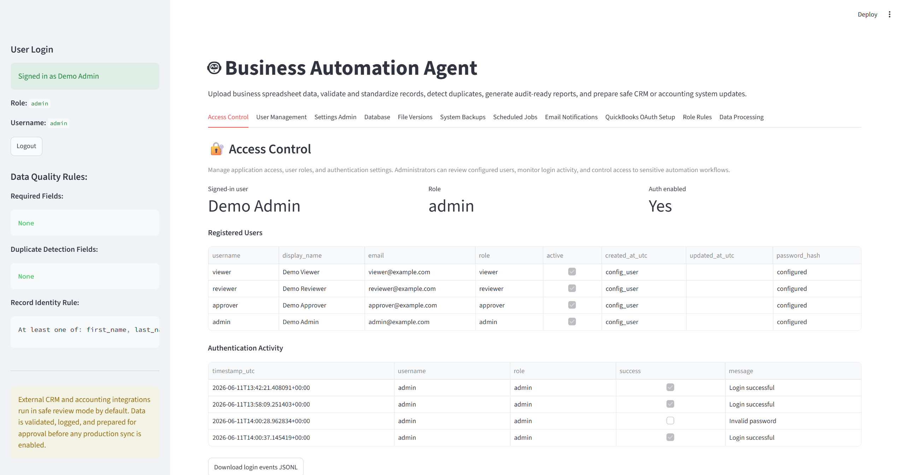
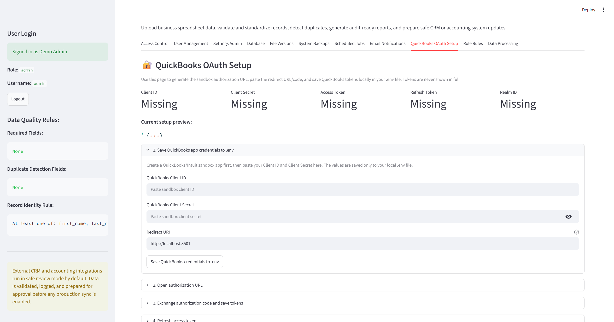
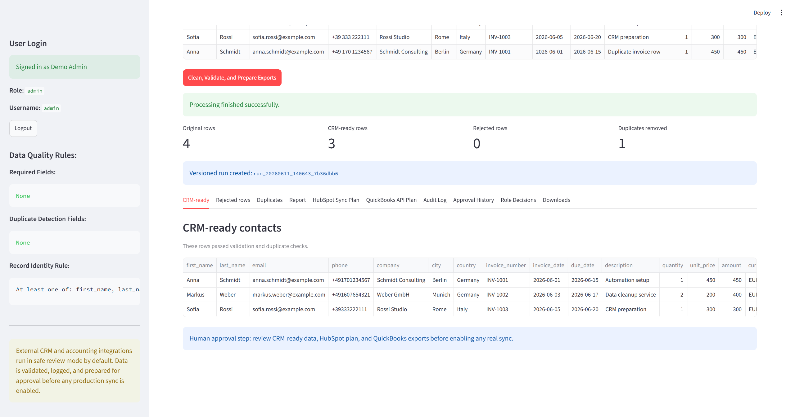
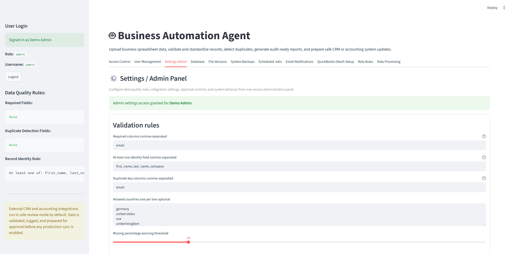
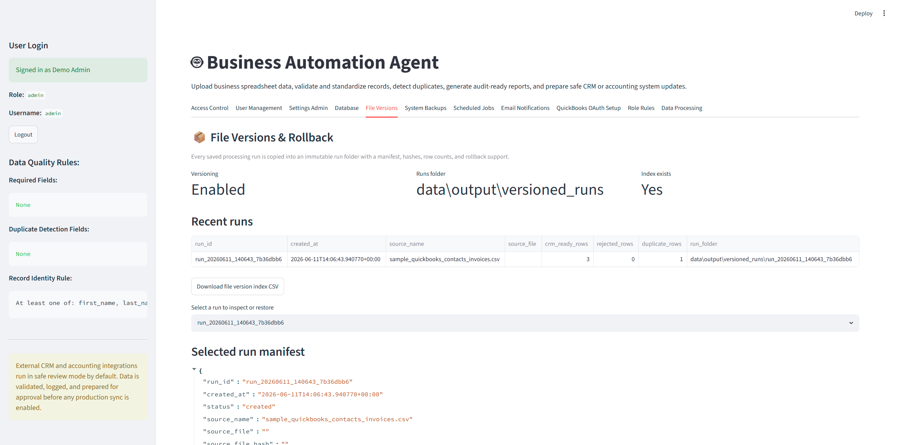
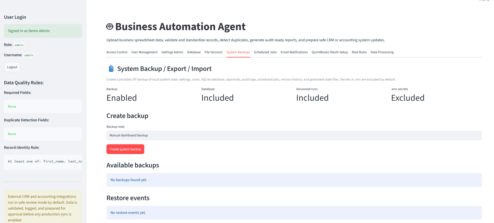

# Business Automation Agent

[](#)
[](#)
[](#)
[](#)
[](#)
[](#)
[](#)

A Python-based business automation agent that cleans spreadsheet data, validates customer/contact records, detects duplicates, prepares CRM and QuickBooks-ready outputs, and adds approval, audit, scheduling, backup, testing, and deployment workflows around the process.

This project is designed as a practical automation tool for small teams, back-office operations, sales teams, finance teams, and business analysts who need a safer way to prepare spreadsheet data before sending it into CRM or accounting systems.


---

## GitHub-ready public release

Version 29 adds a final cleanup layer for public portfolio publishing:

| Area | Added in V29 |
|---|---|
| Secret protection | Stronger `.gitignore`, `.gitattributes`, `SECURITY.md` |
| Public cleanup | `scripts/prepare_public_release.ps1` and Python cleanup helper |
| GitHub upload | `docs/github_upload_checklist.md` |
| Release guidance | `docs/public_release_guide.md` |
| Collaboration | `CONTRIBUTING.md` |

Before pushing to GitHub, run:

```powershell
.\scripts\prepare_public_release.ps1
python -m pytest
.\scripts\run_quality_checks.ps1
```

Then check:

```powershell
git status
```

Make sure `.env`, real customer files, SQLite databases, QuickBooks tokens, HubSpot tokens, and generated output files are not included.


---

## Repository preview



## Why this project is useful

| Business problem | How the agent helps |
|---|---|
| Spreadsheet data is messy | Cleans names, emails, phones, columns and text values |
| CRM uploads create duplicates | Detects duplicates before upload and prepares safer sync plans |
| Missing fields cause failed imports | Separates rejected rows and explains validation issues |
| Accounting data needs review | Creates QuickBooks-ready customer and invoice exports before API sync |
| Teams need accountability | Stores audit logs, approval history, role decisions and processing runs |
| Outputs need recovery | Adds versioned runs, rollback and system backups |

## Visual tour

| Dashboard | QuickBooks OAuth | Audit Log |
|---|---|---|
|  |  |  |

| Settings Admin | File Versions | System Backups |
|---|---|---|
|  |  |  |
---

## Business use case

Many businesses still manage important customer, sales, and invoice data in Excel, CSV files, or Google Sheets. Before that data is uploaded to a CRM or accounting tool, it often needs to be cleaned, checked, approved, and documented.

This project solves that workflow:

```text
Raw spreadsheet
    ↓
Clean and normalize data
    ↓
Validate required fields
    ↓
Detect duplicates and missing values
    ↓
Create clean CRM/QuickBooks-ready outputs
    ↓
Generate audit logs and reports
    ↓
Require human approval before sync
    ↓
Prepare safe CRM / QuickBooks integration plans
```

The goal is not only to automate data entry, but to make the process safer, traceable, and reviewable.

---

## Key features

| Area | Features |
|---|---|
| Data input | CSV and Excel upload, local CLI processing, scheduled folder processing |
| Cleaning | Column normalization, text cleanup, email normalization, phone cleanup |
| Validation | Required fields, missing values, invalid email detection, identity rules |
| Duplicate handling | Duplicate detection by configurable columns such as email |
| Output files | CRM-ready CSV, rejected rows, duplicate rows, reports, Excel exports |
| CRM planning | HubSpot payload preview, existing-contact check structure, sync plan |
| QuickBooks planning | Customer export, invoice export, OAuth setup helper, CustomerRef cache, sandbox sync guardrails |
| Human approval | Approval history, approval manifest, role-based permission checks |
| Authentication | Streamlit login, demo users, admin user management |
| Auditability | CSV/JSONL audit logs, SQLite database, processing run history |
| Automation | Scheduled jobs, archive/error folders, email notification previews |
| Recovery | File versioning, rollback, full system backup/export/import |
| Admin tools | Dashboard settings editor with config backups |
| Deployment | Dockerfile, docker-compose, environment templates, deployment guide |
| Quality | pytest tests, GitHub Actions CI/CD, Ruff linting, Black formatting |
| Documentation | Architecture guide, data-flow guide, API reference, Mermaid diagrams |

---

## Screenshots

Version 28 includes GitHub-ready SVG placeholder screenshots in `docs/screenshots/`. They render directly in GitHub Markdown and can be replaced later with real screenshots from your Streamlit app.

| Screenshot | File |
|---|---|
| Data Processing | `docs/screenshots/dashboard_data_processing.svg` |
| QuickBooks OAuth Setup | `docs/screenshots/quickbooks_oauth_setup.svg` |
| Audit Log | `docs/screenshots/audit_log.svg` |
| Settings Admin | `docs/screenshots/settings_admin.svg` |
| File Versions | `docs/screenshots/file_versions.svg` |
| System Backups | `docs/screenshots/system_backups.svg` |

To replace them, run the app locally, take real screenshots, and save them with the same names.

---

## Demo login

```text
username: admin
password: admin123
```

Other demo roles are included for testing:

```text
viewer     / viewer123
reviewer   / reviewer123
approver   / approver123
admin      / admin123
```

For real use, change these credentials and keep secrets out of GitHub.

---

## Quick start

### 1. Create and activate a virtual environment

```powershell
python -m venv .venv
.venv\Scripts\activate
```

### 2. Install dependencies

```powershell
pip install -r requirements.txt
```

### 3. Run the Streamlit app

```powershell
streamlit run app.py
```

Open the local Streamlit URL in your browser, usually:

```text
http://localhost:8501
```

---

## CLI usage

Process a sample file in safe planning/export mode:

```powershell
python main.py --input data/input/sample_quickbooks_contacts_invoices.csv --skip-approval
```

Run scheduled jobs:

```powershell
python main.py --run-scheduled-jobs
```

List versioned runs:

```powershell
python main.py --list-runs
```

Create a system backup:

```powershell
python main.py --create-system-backup --approved-by "Vladimir Trifonov" --backup-note "Before deployment"
```

---

## Docker usage

Copy the development environment template:

```powershell
copy .env.dev.example .env
```

Run with Docker Compose:

```powershell
docker compose up --build
```

Open:

```text
http://localhost:8501
```

Stop:

```powershell
docker compose down
```

---

## Output files

The app creates outputs in `data/output/`, including:

```text
crm_ready_contacts.csv
rejected_rows.csv
duplicates_removed.csv
report.txt
hubspot_payload_preview.json
hubspot_sync_plan.json
quickbooks_customers_ready.csv
quickbooks_invoices_ready.csv
quickbooks_ready_export.xlsx
quickbooks_customer_ref_cache.json
quickbooks_unresolved_customer_refs.json
automation_audit_log.csv
automation_audit_log.jsonl
approval_history.csv
approval_history.jsonl
automation_agent.db
```

Some files may only appear after specific workflows are used.

---

## Safety-first design

The project is intentionally safe by default:

```yaml
hubspot:
  enabled: false
  dry_run: true

quickbooks:
  dry_run: true
  mode: export_only
  environment: sandbox
```

This means the system prepares files, previews, and sync plans first. Real external sync should only be enabled after OAuth setup, sandbox testing, review, and approval.

---

## Testing and quality checks

Run tests:

```powershell
python -m pytest
```

Run local CI checks:

```powershell
.\scripts\run_ci_checks.ps1
```

Run quality checks:

```powershell
.\scripts\run_quality_checks.ps1
```

Auto-format code:

```powershell
.\scripts\format_code.ps1
```

Expected test result in the included version:

```text
9 passed
```

---

## Project structure

```text
business_automation_agent/
├── app.py
├── main.py
├── config.yaml
├── requirements.txt
├── Dockerfile
├── docker-compose.yml
├── docs/
│   ├── architecture.md
│   ├── data_flow.md
│   ├── api_reference.md
│   ├── diagrams.md
│   ├── portfolio.md
│   └── screenshots/
├── scripts/
├── tests/
├── data/
│   ├── input/
│   ├── output/
│   ├── scheduled_input/
│   ├── scheduled_archive/
│   └── scheduled_errors/
└── src/
    └── automation_agent/
```

---

## Documentation

Start here:

```text
DOCS.md
```

Main docs:

```text
docs/architecture.md
docs/data_flow.md
docs/api_reference.md
docs/diagrams.md
docs/portfolio.md
CI_CD.md
QUALITY.md
TESTING.md
deployment.md
```

---

## Portfolio summary

**Business Automation Agent** is a Python and Streamlit project that demonstrates practical automation engineering: data cleaning, validation, CRM/QuickBooks integration planning, role-based approval, audit logging, SQLite persistence, scheduled jobs, backups, Docker deployment, CI/CD, automated testing, and professional documentation.

It is suitable for a GitHub portfolio, data/automation engineering job applications, freelance business automation proposals, and future SaaS-style development.

---

## Roadmap

Planned future improvements:

- Real HubSpot sandbox sync after final approval
- Real QuickBooks sandbox customer and invoice sync
- Google Sheets connector
- Production SSO with Google Workspace, Azure AD, Auth0, or Okta
- REST API with FastAPI
- Background worker queue
- Cloud deployment guide
- More test coverage for scheduled jobs, backup/restore, and OAuth flows

---

## Security notes

Do not commit private files or business data:

```text
.env
data/output/automation_agent.db
data/output/system_backups/
data/output/versioned_runs/
data/scheduled_input/
data/scheduled_archive/
data/scheduled_errors/
logs/
```

The repository includes `.gitignore`, GitHub Actions security checks, dry-run defaults, and approval steps to reduce the risk of accidental data exposure or unapproved external sync.

---

## Version 27 update

V27 adds a polished portfolio README, business-use-case explanation, badges, feature table, screenshot guidance, and a dedicated portfolio documentation page.

---

## Version 28 additions

Version 28 focuses on GitHub presentation and portfolio polish:

```text
✅ Screenshot placeholder SVGs
✅ GitHub landing-page style README section
✅ Visual tour table
✅ Business problem/solution table
✅ Screenshot replacement guide
✅ GitHub landing page guide
```

See also: `docs/github_landing_page.md`.


## 🎬 Demo Package

Version 30 includes a ready-to-use demo package for interviews, client calls, and portfolio presentations.

### Demo files

```text
demo/data/demo_contacts_mixed_quality.csv
demo/scripts/run_demo.ps1
docs/demo/demo_script.md
docs/demo/walkthrough_steps.md
docs/demo/interview_pitch.md
docs/demo/client_demo_agenda.md
```

### Quick demo run

```powershell
.\demo\scripts\run_demo.ps1
```

Then log in with:

```text
username: admin
password: admin123
```

Upload this file in the Data Processing tab:

```text
demo/data/demo_contacts_mixed_quality.csv
```

Use the demo docs in `docs/demo/` to explain the business problem, workflow, safety controls, and production-readiness features.
