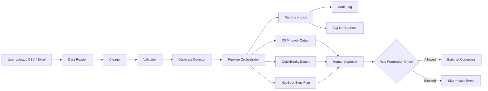

# Architecture Guide — Business Automation Agent V26

This project is designed as a modular Python automation system for cleaning business data, preparing CRM/QuickBooks updates, and protecting every external action with approval, roles, audit logs, and version history.

## High-level architecture



## Main layers

### 1. Interface layer

- `app.py` — Streamlit dashboard for uploads, previews, approvals, settings, users, backups, scheduled jobs, OAuth setup, and downloads.
- `main.py` — command-line interface for file processing, scheduled jobs, backups, rollback, tests, and protected sync commands.

### 2. Core processing layer

Located in `src/automation_agent/core/`.

- `data_reader.py` reads CSV and Excel input.
- `cleaner.py` normalizes column names, text, emails, phone fields, and business-friendly formats.
- `validator.py` checks required fields, missing values, identity rules, and invalid email formats.
- `duplicate_detector.py` removes duplicates by configured identity fields, usually email.
- `pipeline.py` orchestrates the end-to-end process.
- `reporter.py` creates the human-readable report.

### 3. Governance and safety layer

- `approval_history.py` records who approved a run, when, and what output hash was approved.
- `role_based_approval.py` enforces viewer/reviewer/approver/admin permissions.
- `audit_logger.py` records planned, skipped, created, and failed actions.
- `file_versioning.py` creates run IDs, manifests, hashes, and rollback support.
- `database.py` stores users, audit logs, approvals, role decisions, and processing runs in SQLite.

### 4. Integration layer

Located in `src/automation_agent/connectors/`.

- `crm_connector.py` routes CRM actions.
- `hubspot_connector.py` prepares HubSpot payloads and safe sync plans.
- `quickbooks_connector.py` handles QuickBooks-ready exports, OAuth helpers, CustomerRef cache, sandbox planning, and protected sync structure.
- `approval.py` provides human approval helpers.

### 5. Operations layer

- `scheduler.py` processes files from scheduled input folders.
- `email_notifier.py` sends or previews scheduled job notifications.
- `system_backup.py` creates and restores system-state backup ZIP files.
- Docker, GitHub Actions, pytest, Ruff, and Black support deployment and quality checks.

## Folder overview

```text
business_automation_agent_v26/
├── app.py
├── main.py
├── config.yaml
├── requirements.txt
├── pyproject.toml
├── Dockerfile
├── docker-compose.yml
├── docs/
│   ├── architecture.md
│   ├── api_reference.md
│   ├── data_flow.md
│   └── diagrams.md
├── src/automation_agent/
│   ├── core/
│   ├── connectors/
│   └── utils/
├── tests/
├── scripts/
├── data/
└── logs/
```

## Design principle

The agent follows a safe business automation pattern:

1. Read data.
2. Clean and validate data.
3. Create reviewable output.
4. Record report, logs, audit events, and version manifest.
5. Require approval and role permission.
6. Only then allow external CRM/accounting actions.
