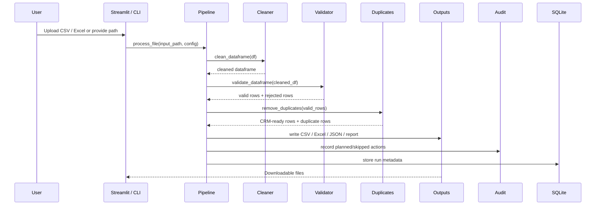
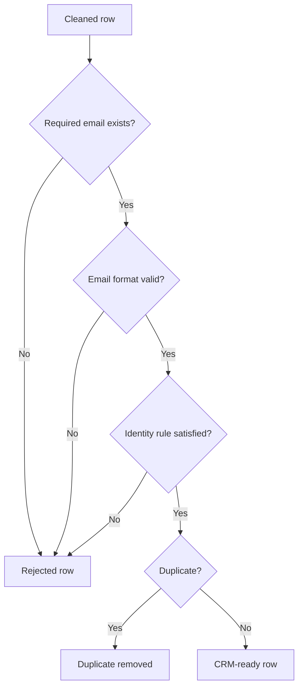
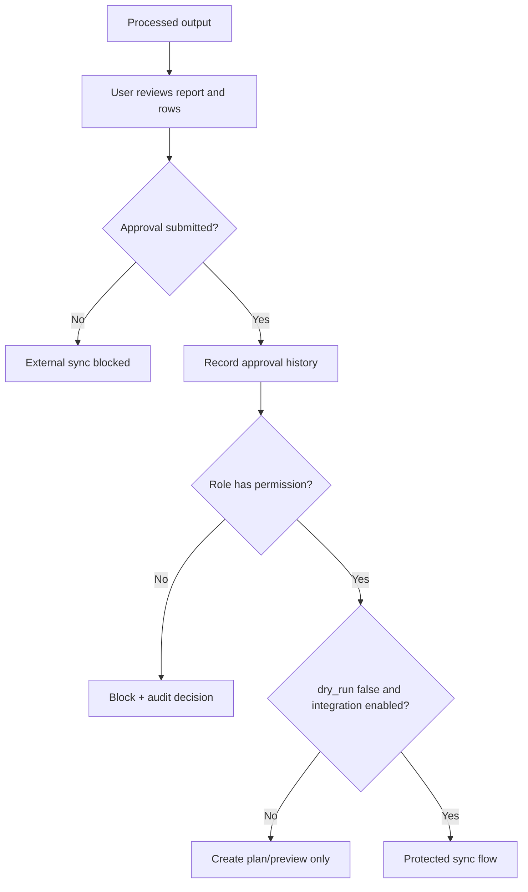

# Data Flow Guide

This document explains how a file moves through the Business Automation Agent.

## Processing flow

## Output categories

| Output | Purpose |
|---|---|
| `crm_ready_contacts.csv` | Clean contacts that can be imported or synced to CRM |
| `rejected_rows.csv` | Rows blocked by validation rules |
| `duplicates_removed.csv` | Rows removed as duplicates |
| `report.txt` | Human-readable summary of changes |
| `hubspot_sync_plan.json` | Create/update/unknown plan for HubSpot |
| `quickbooks_ready_export.xlsx` | Reviewable QuickBooks customer/invoice workbook |
| `quickbooks_customer_ref_cache.json` | Cached QuickBooks CustomerRef IDs |
| `automation_audit_log.csv` | Governance log of planned/skipped/created/failed actions |
| `latest_run_manifest.json` | Hashes, row counts, file version, and run metadata |

## Validation flow

## Approval flow

