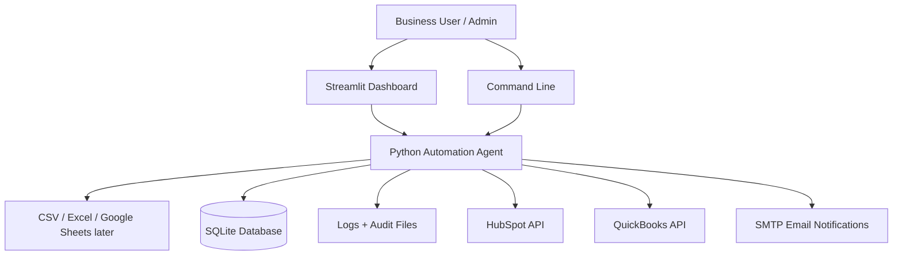
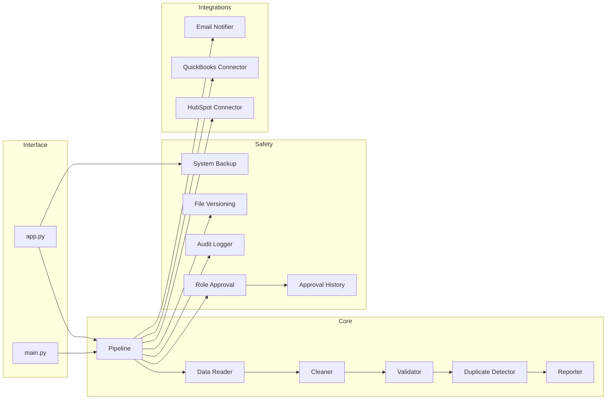
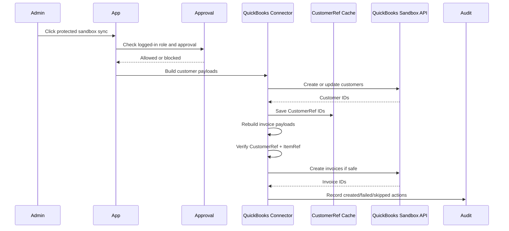
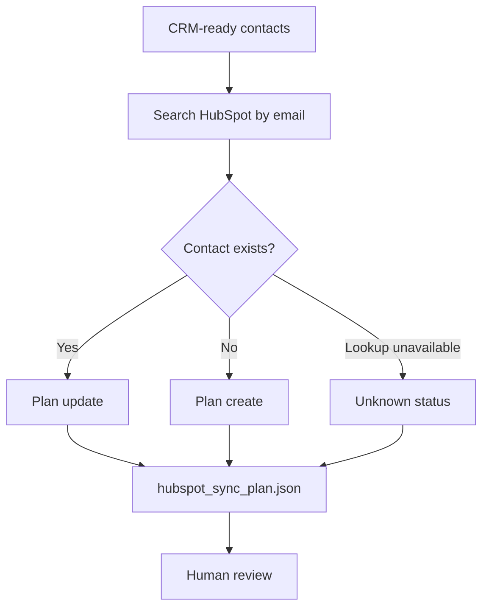
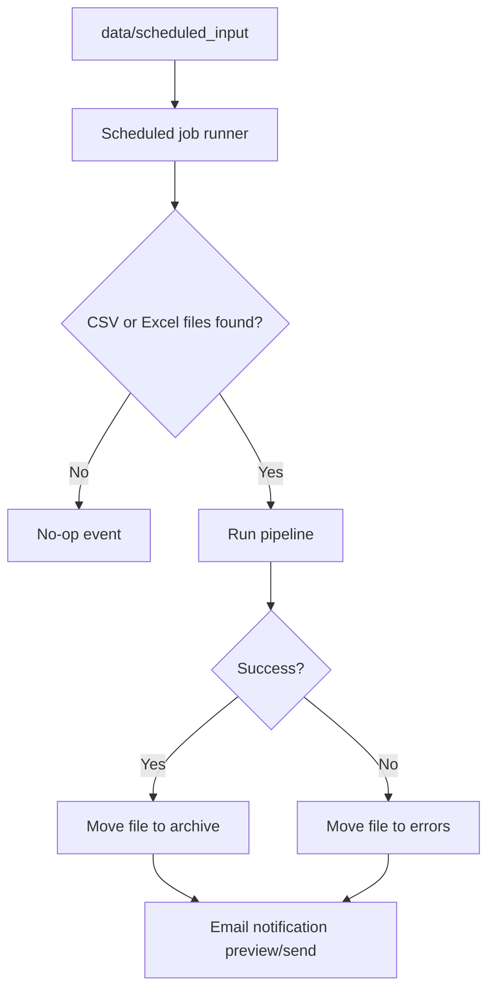
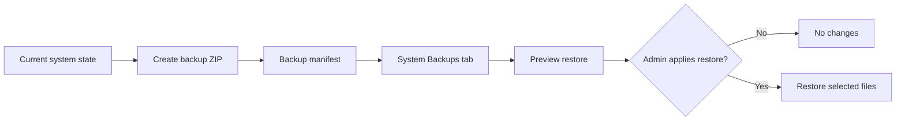

# Architecture Diagrams

These diagrams use Mermaid syntax, which renders automatically in GitHub Markdown.

## System context

## Component diagram

## QuickBooks protected sync

## HubSpot sync plan

## Scheduled jobs

## Backup and restore

